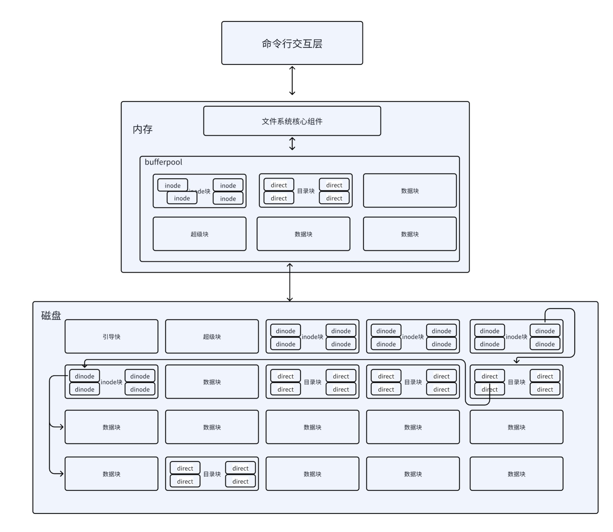

# Rust 文件系统模拟器

一个使用 **Rust** 实现的用户态类 UNIX 文件系统模拟器。

该项目在用户空间中完整模拟了一个支持 **多用户、多级目录、inode 索引、权限控制、内存缓冲池与磁盘 I/O** 的文件系统。

---

## 项目亮点

- 基于 Rust 的安全、模块化实现
- 类 UNIX 的多级目录结构
- 多用户与权限控制模型
- 完整的文件生命周期管理
- inode + 数据块的经典文件系统设计
- 基于 **LRU-K** 的页面缓冲池

---


---

## 核心功能

### 文件与目录管理
- 多级目录结构
- 文件 / 目录的创建与删除
- 目录切换
- 目录内容展示（包含权限信息）

### 用户与权限模型
- 支持多用户同时存在
- UNIX 风格权限位（r / w / x）
- 所有者 / 同组用户 / 其他用户的权限校验
- 用户级文件隔离

### 存储与索引机制
- 使用普通文件模拟磁盘文件卷
- inode 统一描述文件与目录
- 支持多级索引的数据块映射
- 成组链接法管理空闲磁盘块
- 超级块维护文件系统全局状态

### 缓冲池与缓存管理
- 页面级缓存
- 基于可扩展哈希表的 O(1) 查找
- 脏页延迟回写
- 减少磁盘随机访问次数

### LRU-K 页面置换算法
- 历史访问队列 + 缓存队列分离
- 降低缓存污染风险
- 更适合文件系统访问模式

---

## 系统整体架构

```text
+------------------------+
|      命令行交互层      |
+-----------+------------+
            |
+-----------v------------+
|     文件系统核心层     |
| (inode / 目录 / 权限) |
+-----------+------------+
            |
+-----------v------------+
|        缓冲池层        |
|        (LRU-K)         |
+-----------+------------+
            |
+-----------v------------+
|     虚拟磁盘 I/O       |
|   (文件模拟磁盘)       |
+------------------------+
```


## 系统使用教程
```bash
cargo run

Running `target\debug\filesystem.exe`

Do you want to format the disk? (y(es)/n(o)) :
n

>install
Please enter your account to log in
        USERNAME:   root
        PASSWORD:   root

Login success!

root@VirtualUbuntu:~/root help
 $ ls           显示当前目录
 $ mkdir        创建目录
 $ cd   跳转目录
 $ creat        创建文件
 $ close        关闭已经打开的文件
 $ delete       删除文件
 $ cruser       创建用户
 $ halt         关机
 $ logout       退出账户
 $ aopen        打开文件
 $ copy 复制文件
 $ pst  粘贴文件
 $ help         显示帮助
 $ fmt          格式化
 $ rd           读文件
 $ wr           写文件
 $ cls          清屏

root@VirtualUbuntu:~/root ls
CURRENT DIRECTORY :
.                   drwxr-x---  <dir>
..                  drwxr-x---  <dir>
etc                 drwxr-x---  <dir>

```

## 更多文档

项目的详细设计与实现说明请参见 `/doc/项目介绍.pdf`